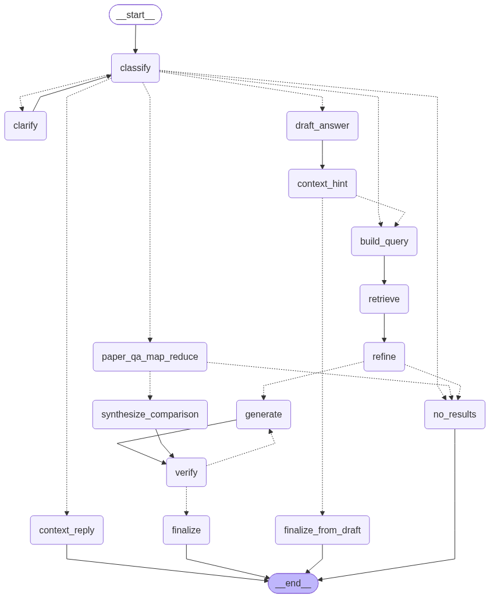

# Veritas — a research agent over arXiv & Semantic Scholar

Veritas is a LangGraph-based conversational agent that answers research questions by routing each question through an intent classifier, retrieving from arXiv / Semantic Scholar / a paper's own full text, filtering what it retrieved, generating a cited answer, and then fact-checking its own citations before it's allowed to respond. When the fact-check fails, the graph loops back and tries again instead of shipping a possibly-wrong answer — that retrieve → refine → generate → verify loop is the core idea Veritas is built around.

It ships as an interactive terminal chatbot (`main.py`), backed by a 15-node LangGraph state machine.

## Contents

- [The flow](#the-flow)
- [Where the self-correction happens](#where-the-self-correction-happens)
- [Design & code quality](#design--code-quality)
- [Where the tools come from](#where-the-tools-come-from)
- [Project structure](#project-structure)
- [Setup](#setup)
- [Configuration](#configuration)
- [Running it](#running-it)
- [Acknowledgments](#acknowledgments)

## The flow

Every question enters the graph at `classify` and leaves through one of four terminal nodes (`context_reply`, `finalize_from_draft`, `no_results`, `finalize`). The full state machine, generated directly from the graph defined in `Veritas_Service._build_graph()` — `Veritas_Service` being Veritas's core orchestrator class:



Walking it end to end:

**1. Classify.** A structured-output LLM call (`ClassifyResult`) assigns the question exactly one primary intent — `PAPER_LOOKUP`, `PAPER_QA`, `AUTHOR_LOOKUP`, `RECENT_DIGEST`, `CITATION_GRAPH`, `OPEN_ENDED`, or `GENERAL_CHAT` — extracts whatever slots apply (author name, arXiv ID, category, date window, paper IDs to compare, a rewritten search string), and, for compound questions ("summarize paper X *and* find recent robotics papers"), splits off independent `additional_actions` so each part of the question can be retrieved separately.

**2. Route.** One function, `_route_after_classify`, makes six decisions in priority order:
   - `GENERAL_CHAT` → answer from conversation history alone, no retrieval at all.
   - Ambiguous → ask a clarifying question (unless already asked twice, then give up gracefully).
   - A standalone multi-paper `PAPER_QA` comparison → the map-reduce branch.
   - A specific, unambiguous intent (or more than one action) → go straight to the tools.
   - Otherwise (`OPEN_ENDED`) → try the model's own knowledge first.

**3. Clarify, if needed.** `clarify` calls LangGraph's `interrupt()` to pause the graph mid-execution and surface a single clarifying question to the caller. The CLI prints it, reads the user's reply, and resumes the *same* graph run with `Command(resume=answer)` — the checkpointer (`MemorySaver`, keyed by session ID) is what makes that resume possible. The enriched question is re-classified, capped at two rounds before the graph gives up rather than looping forever.

**4. Try the model's own knowledge first (`draft_answer` → `context_hint`).** For `OPEN_ENDED` questions, the agent drafts an answer *and* a self-rated confidence score before touching any tool. If confidence ≥ 0.6, it answers immediately from that draft (`finalize_from_draft`) — no retrieval, no verification, no external calls. Below that threshold, the same draft is discarded and the question falls through to real retrieval. This pre-retrieval knowledge check is the first corrective mechanism in the pipeline.

**5. Build the query & retrieve, concurrently.** `build_query` turns each action into a concrete tool call (e.g. `PAPER_LOOKUP` with a title → `search_title`; `CITATION_GRAPH` → `get_paper_citations` or `get_related_papers` depending on direction). `retrieve` then dispatches every tool call at once with `asyncio.gather(..., return_exceptions=True)`, so a question with three independent parts fires three requests in parallel and one failing tool doesn't take the others down with it. A second corrective mechanism lives here too: if a `search_semantic_scholar` call is rate-limited or returns nothing, `PaperRetriever` automatically retries the same query against plain arXiv search before giving up.

**6. Refine.** `refine` runs every retrieved chunk through an LLM relevance judge (strict 0.0–1.0 scoring, conservative above 0.7), drops anything at or below the threshold, sorts what's left best-first, caps it at 8 documents, and assigns each surviving document a numbered citation label (`[1]`, `[2]`, …). This is the step that keeps noisy keyword-search results from polluting the final answer. If nothing survives, the graph exits early via `no_results` instead of generating from empty context.

**7. Multi-paper comparisons take a separate map-reduce path.** When the question names more than one specific paper for `PAPER_QA`, `paper_qa_map_reduce` retrieves, filters, and summarizes each paper *independently and in parallel* — so no single LLM call ever has to hold two papers' full text in context at once. `synthesize_comparison` (the reduce step) then treats each paper's isolated summary as one citable source and produces the actual comparison, feeding into the same verification path as everything else.

**8. Generate.** `generate` synthesizes an answer from the refined context only, with every factual claim required to carry an inline citation marker. If this is a retry after a failed verification, the prompt additionally forbids inventing marker numbers that weren't in the sources.

**9. Verify — the correction loop.** `verify` is a second, independent LLM pass that fact-checks the answer against its own citations: every `[n]` marker must exist in the source set, every source must actually support the sentence it's attached to (checked in concurrent batches of 5 claims), and an answer with sources but *no* citations at all is rejected outright. If verification fails and the retry budget (2 attempts) isn't exhausted, the graph routes back to `generate`; otherwise it accepts the best attempt it has and moves on. This generate ⇄ verify loop is the pipeline's main self-correction mechanism — a failed answer doesn't go out as-is, it gets regenerated.

**10. Finalize.** The verified answer gets a formatted reference list appended and the turn is appended to `chat_history` (a LangGraph reducer field, so turns accumulate automatically across the session rather than needing to be merged by hand).

## Where the self-correction happens

A plain retrieval pipeline is retrieve → generate. Veritas has four separate points where it can decide its first attempt wasn't good enough and correct course before answering:

| Stage | What it corrects | Fallback |
|---|---|---|
| `context_hint` | "Do I even need to retrieve?" | Skips retrieval entirely if the model is already confident |
| `PaperRetriever` (chain-of-search) | A failed/empty/rate-limited retrieval | Retries against a different tool for the same query |
| `refine` | Irrelevant or off-topic retrieved chunks | Filters them out before they reach generation |
| `verify` → `generate` | Unsupported or fabricated citations | Regenerates the answer, up to 2 attempts |

## Design & code quality

- **Single-responsibility collaborators.** `Veritas_Service` (the graph's node methods) doesn't do retrieval, scoring, generation, or verification itself — it delegates to small, independently testable classes it composes in `__init__`: `PaperRetriever`, `RelevanceRefiner`, `AnswerGenerator`, `CitationVerifier`, `ReferenceFormatter`, `ContextResponder`. Each has one job and no knowledge of the graph around it.
- **Structured everywhere an LLM speaks.** Every LLM call that needs to be *acted on* programmatically returns a Pydantic model via `.with_structured_output(...)` — `ClassifyResult`, `Score`, `DraftAnswer`, `BatchCitationSupport` — instead of parsed free text, which removes a common source of brittleness in LLM pipelines.
- **Fail-open, never fail-crash.** Nearly every external call (LLM or HTTP) is wrapped in `try/except`, logged to a dedicated `error_logger` (rather than surfaced raw to the user), and backed by a safe default. `PaperRetriever._call_tool` explicitly documents its "never raises — returns `(result, failed)`" contract so callers can branch on failure vs. genuine emptiness without a second `try/except`.
- **Concurrency used deliberately, not by accident.** Independent tool calls and independent per-paper map-reduce summaries run via `asyncio.gather(..., return_exceptions=True)` so one slow or failing branch doesn't serialize or sink the rest. Synchronous SDK calls (arXiv/Semantic Scholar HTTP clients) are pushed onto worker threads with `asyncio.to_thread` so they don't block the event loop.
- **Infra-level resilience for external APIs**, in `arxiv_service`: a shared, thread-safe `RateLimiter` so arXiv/Semantic Scholar always see one well-behaved caller; a `requests` session with `urllib3` retry/backoff on 429/5xx; and a hard wall-clock deadline (`call_with_deadline`) so one slow upstream response can't hang a tool call indefinitely.
- **Validated at the boundary.** `arxiv_service/validation.py` checks arXiv ID shape (both `2301.00001` and legacy `cs/0001001` styles), category codes, and query length *before* anything hits the network, raising a typed error hierarchy (`ValidationError` / `NotFoundError` / `UpstreamUnavailableError`) instead of leaking raw parser exceptions upward.
- **Bounded, persistent state for the PDF index.** `PdfVectorStore` keeps at most 8 FAISS indices warm in memory (`OrderedDict` LRU) while persisting all of them to disk, so `PaperQA` re-indexing is idempotent (`ensure_indexed` checks the registry first) and a long session doesn't grow memory unboundedly.
- **One config surface per concern**: `llm_config.yaml` for provider/model/API-key pools and rate limits, `arxiv_service/config.py` (pydantic-settings) for the tool layer's environment variables — rather than `os.getenv` calls scattered through the codebase.

## Where the tools come from

The 12 arXiv/Semantic Scholar tools in `arxiv_service/` are a direct, in-process adapter over **[github.com/MeetRVyas/arxiv-mcp-server](https://github.com/MeetRVyas/arxiv-mcp-server)**. That project exposes these as MCP tools (over the Model Context Protocol, with `Context` objects and MCP response envelopes); `arxiv_service/service.py` mirrors each tool's validation and enrichment logic but strips the MCP protocol plumbing so `Veritas_Service.TOOL_REGISTRY` can call them as plain, directly-importable Python functions with no protocol hop.

| Tool | Purpose |
|---|---|
| `search_papers` | Keyword/field search across arXiv |
| `get_paper_details` | Full metadata for one paper, enriched with Semantic Scholar citation counts/venue when available |
| `get_paper_pdf_url` | PDF / ar5iv HTML / LaTeX source links (no network call) |
| `get_recent_papers` | Newest submissions to a category within a lookback window |
| `get_related_papers` | A paper's outgoing references (Semantic Scholar) |
| `get_paper_citations` | Papers that cite a given paper — incoming citations |
| `get_author_papers` | An author's arXiv papers (partial name matching) |
| `search_by_category` | Keyword search scoped to one arXiv category |
| `search_title` | Search restricted to paper titles |
| `search_abstract` | Search restricted to abstracts |
| `batch_get_papers` | Up to 20 papers in a single round trip |
| `search_semantic_scholar` | Broader search including non-arXiv work, with field-of-study/year filters |

A 13th tool, **`pdf_rag_search`**, is native to *this* repo (`rag_service.py`) rather than borrowed: it downloads a paper's PDF, chunks it, embeds the chunks, and indexes them in a per-paper FAISS store, giving the `PAPER_QA` intent access to a paper's actual full text instead of just its abstract.

## Project structure

```
.
├── main.py                    # State, graph nodes, routing, Veritas_Service, CLI loop
├── rag_service.py             # Full-text PDF RAG: download → chunk → embed → FAISS
├── llm_factory.py             # Provider-agnostic LLM / embeddings factory
├── llm_config.yaml            # Provider → model / API-key pool / rate-limit config
├── config.py                  # Global constants (providers, retry knobs, config path)
├── models.py                  # Paper/Intent/ClassifyResult/Score + API-layer DTOs
├── .env.example                # Environment variable template
├── arxiv_service/              # Adapter over github.com/MeetRVyas/arxiv-mcp-server
│   ├── service.py               # The 12 plain-function tool wrappers
│   ├── arxiv.py                 # arXiv Atom API client
│   ├── semantic_scholar.py      # Semantic Scholar API client
│   ├── validation.py            # arXiv ID / category / query validation
│   ├── rate_limiter.py          # Shared thread-safe rate limiter
│   ├── http_utils.py            # Retry session + hard request deadlines
│   ├── errors.py                 # Typed error hierarchy
│   └── config.py                 # pydantic-settings for tool-layer env vars
└── docs/
    └── graph.png                # The workflow diagram above
```

`logs/`, `pdf_cache/`, and `vector_store/` are created at runtime (error log, downloaded PDFs, and per-paper FAISS indices, respectively) — none of them ship in the repo.

## Setup

**Prerequisites:** Python 3.11+, and a Google Gemini API key (the default/only wired provider — see [Notes & known gaps](#notes--known-gaps) for what else `llm_factory.py` expects).

1. Install dependencies (no `requirements.txt` ships with this snapshot — the set below covers every import across the codebase, largely lifted from the header comment in `rag_service.py`):

   ```bash
   pip install langgraph langchain-core langchain-community langchain-google-genai \
       langchain-text-splitters pypdf faiss-cpu rich prompt_toolkit python-dotenv \
       pyyaml pydantic pydantic-settings requests --break-system-packages
   ```

2. Copy `.env.example` to `.env` and fill in `GEMINI_API_KEY1` (and `GEMINI_API_KEY2` for key-pool rotation, if you have one). `SEMANTIC_SCHOLAR_API_KEY` is optional — without it you get roughly 1 req/s to Semantic Scholar, with it roughly 10 req/s.

3. Resolve the missing internal dependency in `llm_factory.py` — see the first item under [Notes & known gaps](#notes--known-gaps) before running.

## Configuration

- **`llm_config.yaml`** is the source of truth for which provider/model Veritas actually uses, which environment variables hold its API keys (a *list*, so it can round-robin across multiple keys), and its requests-per-minute / requests-per-day budget.
- **Tunable thresholds live as class constants on `Veritas_Service`** in `main.py` rather than being hardcoded inline: `LOWER_THRESHOLD` (0.3, relevance cutoff in `refine`), `DRAFT_CONFIDENCE_THRESHOLD` (0.6, the "answer from memory" gate), `MAX_CLARIFICATION_ROUNDS` (2), `MAX_GENERATION_ATTEMPTS` (2), `MAX_CONTEXT_DOCS` (8), `DEFAULT_CATEGORY` (`cs.AI`), `DEFAULT_RECENT_DAYS` (7).

## Running it

```bash
python main.py
```

This starts an interactive terminal session (`rich` + `prompt_toolkit`), regenerates `docs/graph.png` from the live graph on startup, and gives each session a UUID that doubles as its LangGraph checkpoint thread ID — so a clarifying-question interrupt mid-conversation resumes correctly. Type `exit`, `quit`, or press `Ctrl+D` to leave.

## Acknowledgments

The `retrieve` → `refine` → `generate` → `verify` loop at the center of this pipeline — pulling context, scoring and filtering it for relevance before it ever reaches the generator — is inspired by the retrieval-evaluation and correction ideas in:

> Yan, S.-Q., Gu, J.-C., Zhu, Y., & Ling, Z.-H. (2024). *Corrective Retrieval Augmented Generation*. arXiv:2401.15884.

This repo is not the paper's own codebase.